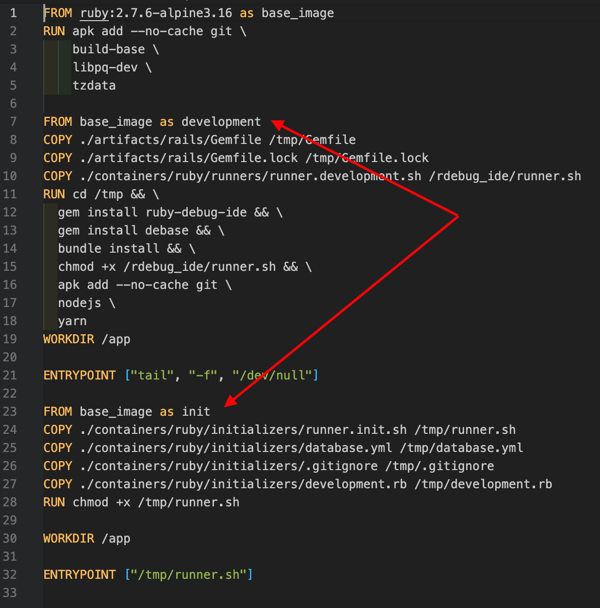
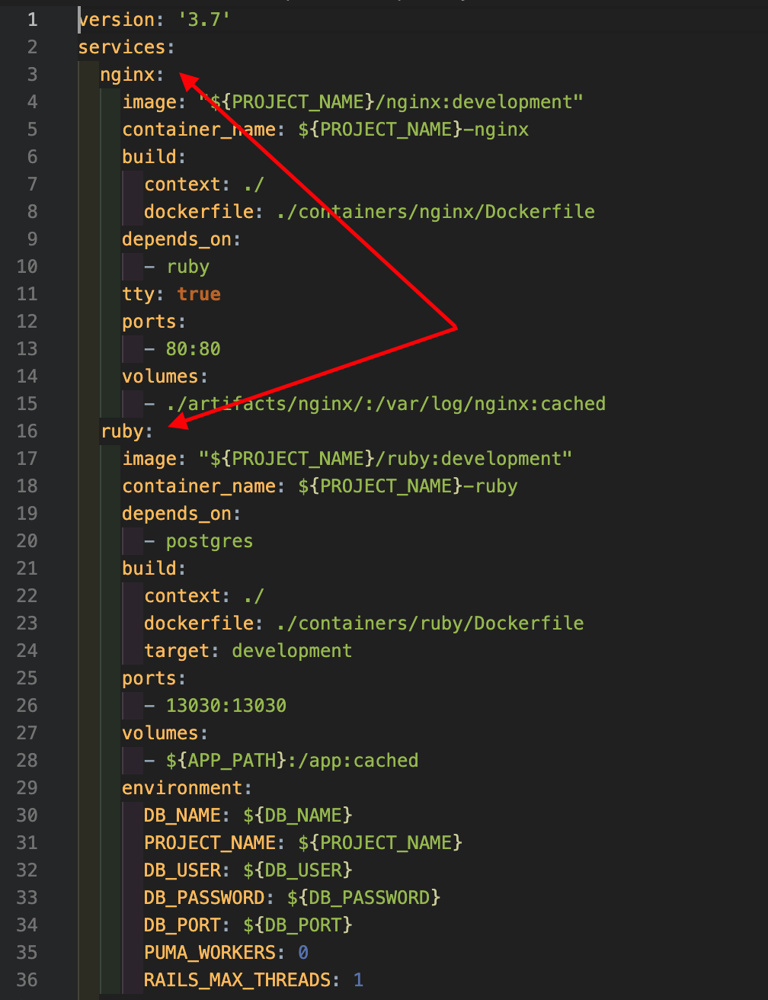

## Environment stages
In the ./environment directory you can find `docker-compose.development.yml` file. If you need some other environment you are able to do so with next steps:
* Create `docker-compose.${env_name}.yml` and configure it by your project needs. 
* In ./environment/containers you'll find three initial containers. In those directories you will find Dockerfile files with described stages. Create your own stage.
* Build your stage 
  ```bash
  make build t=${env_name}
  ```
* Run your stage
  ```bash
  make start t=${env_name}
  ```
* Open console in your stage
  ```bash
  make shell t=${env_name} c=${container_name}
  ```  
  ```bash
  #For example, when you are running the following command
  make shell
  #it's the same as
  make shell t=development c=ruby
  ```

Example of stages


Container names

